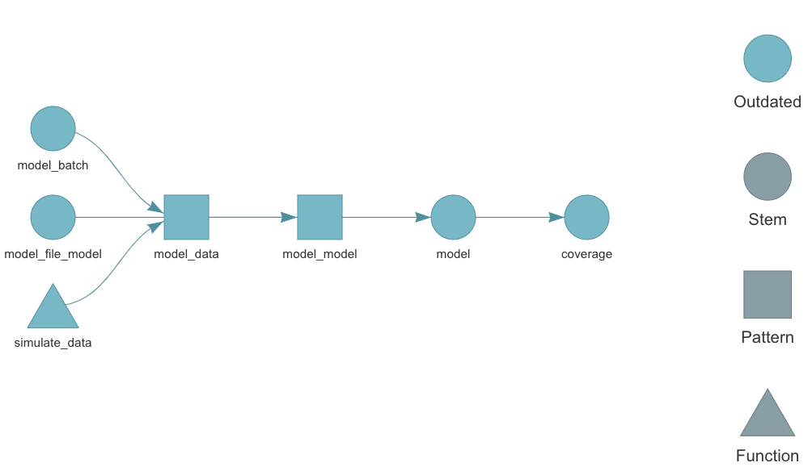

<style>
.inverse {
background-color: transparent;
text-shadow: 0 0 0px transparent;
}
.title-slide {
vertical-align: bottom !important; 
text-align: center !important;
}
.title-slide h1 {
position: absolute;
top: 0;
left: 0;
right: 0;
width: 100%;
line-height: 4em;
color: #666666;
font-size: 2em;
}
.title-slide h3 {
line-height: 6em;
color: #666666;
}
.title-slide {
background-color: white;
background-image: url('images/logo.png');
background-repeat: no-repeat;
background-size: 25%;
}
.remark-slide-content:after {
content: "Copyright Eli Lilly and Company";
position: absolute;
bottom: -5px;
left: 10px;
height: 40px;
width: 100%;
font-family: Helvetica, Arial, sans-serif;
font-size: 0.7em;
color: gray;
background-repeat: no-repeat;
background-size: contain;
}
.remark-slide-content .nocopyright:after {
content: "";
}
.small {
  font-size: 85%;
}
</style>

```{r, include = FALSE}
knitr::opts_chunk$set(
  collapse = TRUE,
  warning = FALSE,
  comment = "#>",
  fig.align = "center",
  fig.width = 10,
  fig.height = 7,
  out.width = "80%",
  out.height = "80%"
)
```

```{r, include = FALSE, message = FALSE}
options(
  warnPartialMatchArgs = FALSE,
  drake_clean_menu = FALSE,
  drake_make_menu = FALSE,
  htmltools.dir.version = FALSE
)
packages <- c(
  "targets",
  "keras",
  "recipes",
  "rsample",
  "tidyverse",
  "yardstick"
)
purrr::walk(
  packages,
  function(pkg) {
    suppressMessages(suppressWarnings(library(pkg, character.only = TRUE)))
  }
)
Sys.setenv(TAR_SCRIPT_ASK = "false")
tar_destroy()
```

## Demanding computation in R

* **Bayesian data analysis: JAGS, Stan, NIMBLE, `greta`**
* Deep learning: `keras`, `tensorflow`, `torch`
* Machine learning: `tidymodels`
* PK/PD: `nlmixr`, `mrgsolve`
* Clinical trial simulation: `rpact`, `Mediana`
* Statistical genomics
* Social network analysis
* Permutation tests
* Database queries: `DBI`
* ETL on large data

---

## Overlooked realities of long computation


---

## Workflows have interconnected steps.


---

## If you change code or data...


---

## ...the downstream steps are no longer valid.


---

## Dilemma: short runtimes or reproducible results?


---

## Let a pipeline tool figure out what to rerun.


* Save time while ensuring computational reproducibility.
* Automatic parallel/distributed computing based on the directed acyclic graph.

---

## Pipeline tools

<center>

</center>

* Existing pipeline tools: https://github.com/pditommaso/awesome-pipeline
* Most are language-agnostic or designed for Python or the shell.

## {targets}

* Fundamentally designed for R.
* Supports a clean, modular, function-oriented programming style.
* Abstracts files as R objects and automatically manages data.
* Surpasses the permanent limitations of its predecessor, [`drake`](https://github.com/ropensci/drake): <https://books.ropensci.org/targets/drake.html>.
* Continuation of the ideas from `remake` by Rich FitzJohn: <https://github.com/richfitz/remake>.

---

## Custom user-side code in {targets}

* Most pipelines have a lot of user-side code.
* `targets` prefers this code to be in pure user-defined functions.
    * Allows `targets` to clearly parse the relationships among the inputs and outputs.
    * Strong precedent: user-defined functions are fundamental to most computer languages.

> Nearly everything that happens in R results from a function call. Therefore, basic programming centers on creating and refining functions.
>
> [John Chambers (2008)](https://www.springer.com/gp/book/9780387759357)

## Drawbacks

* A lot of work.
* A lot of software engineering.
    
## Solution: extend {targets} to abstract away user-side burden

* `stantargets` and other domain-specific R Targetopia packages: https://wlandau.github.io/targetopia/
* Target Markdown, an R Markdown interface for prototyping and pipeline construction: https://books.ropensci.org/targets/markdown.html
  
---

## Extending {targets}


---

## Target factories

* A target factory is a reusable function that creates target objects.

```{r, eval = FALSE}
target_factory <- function(file) {
  list(
    tar_target_raw("file", file, format = "file", deployment = "main"),
    tar_target_raw("data", quote(read_data(file)), format = "fst_tbl", deployment = "main"),
    tar_target_raw("model", quote(run_model(data)), format = "qs")
  )
}
```

---

## Target factories simplify pipeline construction.

```{r, eval = FALSE}
# _targets.R
library(targets)
library(yourExamplePackage)
list(
  target_factory("data.csv")
)
```

```{r, eval = FALSE}
# R console
tar_manifest(fields = command)
#> # A tibble: 3 x 2
#>   name  command          
#>   <chr> <chr>            
#> 1 file  "\"data.csv\""   
#> 2 data  "read_data(file)"           
#> 3 model "run_model(data)"
```

---

## Example: {stantargets}

<center>
<image src="./images/stantargets.png" height = "300px">
</center>

* Easy pipeline construction for Stan statistical models.
* Uses R packages [`cmdstanr`](https://mc-stan.org/cmdstanr/) and [`posterior`](https://mc-stan.org/posterior/).

---

## About Stan

* Probabilistic programming language ([Carpenter et al. 2017](https://www.jstatsoft.org/article/view/v076i01)).
* Markov chain Monte Carlo (MCMC) with HMC and NUTS.
    * Often more efficient than Gibbs sampling.
    * Flexible specification of posterior distributions.
    * Indifferent to conjugacy.
* Variational inference (ADVI)
* Penalized MLE (L-BFGS)

---

## Example: Bayesian longitudinal model for clinical trial data

$$
\begin{aligned}
& y \sim \text{MVN}(X_{(n \cdot t) \times p} \beta, \ I_{n \times n} \otimes \Sigma_{t \times t} ) \\
& \qquad \beta \sim \text{MVN} (0, 10^2 I_{p \times p})\\
&  \qquad \Sigma_{t \times t} = \left (I_{t \times t} \sigma \right ) \Lambda_{t \times t} \Lambda_{t \times t}' \left (I_{t \times t} \sigma \right ) \\
& \qquad \qquad \sigma_1, \ldots, \sigma_t \stackrel{\text{ind}}{\sim} \text{Cauchy}^+(0, 5) \\
& \qquad \qquad \Lambda_{t \times t}\Lambda_{t \times t}' \sim \text{LKJ}(\text{shape} = 1, \text{order} = t)
\end{aligned} 
$$

---

## Example Stan model

```{c, eval = FALSE}
// model.stan
model {
  vector[n_observations] mu = x * beta; // mean response
  for (patient in 1:n_patients) { // model each patient separately
    // ...
    // Each patient is multivariate normal with the same unstructured covariance:
    y[first_visit:last_visit] ~ multi_normal_cholesky(mu[first_visit:last_visit], diag_pre_multiply(sigma, lambda));
  }
  beta ~ normal(0, s_beta); // independent fixed effects
  sigma ~ cauchy(0, s_sigma); // diffuse prior on the visit-specific standard deviations
  lambda ~ lkj_corr_cholesky(1); // LKJ prior on the correlations among visits
}
```

---

## Interval-based validation study

* For thousands of independent replications:
    * Simulate data from the prior predictive distribution.
    * Fit the model to the simulated data using MCMC.
    * Calculate x% posterior intervals for each of `beta[1]` and `beta[2]`.
* For each of `beta[1]` and `beta[2]`, roughly x% of the posterior intervals should cover the corresponding parameter draws from the joint prior.
* Simulation-based calibration extends this idea further ([Cook et al. 2006](https://www.jstor.org/stable/27594203); [Talts et al. 2020](https://arxiv.org/abs/1804.06788)).

---

## One function for prior predictive simulations

No other user-defined functions required.

```{r, eval = FALSE}
simulate_data <- function(n_patients = 50, n_visits = 3, n_arms = 2) {
  # simulation code ...
  
  # Stan data list:
  list(
    data = data, y = data$response, x = x,
    n_arms = n_arms, n_beta = length(beta),
    n_observations = n_patients * n_visits,
    n_patients = n_patients, n_visits = n_visits,
    s_beta = 2, s_sigma = 1,
    # Hold on to draws from the prior:
    .join_data = list(
      beta = beta,
      sigma = sigma,
      lambda = lambda
    )
  )
}
```

---

## _targets.R file setup

```{r, eval = FALSE}
library(targets)
library(stantargets)
source("R/functions.R")
tar_option_set(packages = "tidyverse")
options(clustermq.scheduler = "multicore") #<<
list(
  tar_stan_mcmc_rep_summary(
    name = model, stan_files = "model.stan", data = simulate_data(),
    batches = 160, reps = 25, variables = "beta",
    summaries = list(
      ~posterior::quantile2(.x, probs = c(0.025, 0.25, 0.75, 0.975)),
      rhat = posterior::rhat
    ),
  ),
  tar_target(coverage, calculate_coverage(model))
)
```

---

## Multiple targets



---

## Run MCMC batches in parallel

```{r, eval = FALSE}
> tar_make_clustermq(workers = 4) # 4 local cores
#> • start target model_batch
#> • built target model_batch
#> • start branch model_data_b0b9380a
#> • start branch model_data_ffcdb73c
#> • start branch model_data_b968a03a
#> • start branch model_data_f8763cb2
#> ...
```

* High-performance computing with `targets`: <https://books.ropensci.org/targets/hpc.html>
* Distributed computing available, not just multicore: SLURM, SGE, TORQUE, PBS, LSF 
* Persistent workers with the [`clustermq`](https://mschubert.github.io/clustermq/) package: `tar_make_clustermq()`
* Transient workers with the [`future`](https://future.futureverse.org/) package: `tar_make_future()`
* Monitor progress with [`tar_watch()`](https://docs.ropensci.org/targets/reference/tar_watch.html), [`tar_poll()`](https://docs.ropensci.org/targets/reference/tar_poll.html), or [`tar_progress_branches()`](https://docs.ropensci.org/targets/reference/tar_progress_branches.html).

---

## Simulation results

```{r, eval = FALSE}
tar_read(model)
#> # A tibble: 8,000 x 10
#>    variable    q2.5     q25    q75   q97.5  rhat .join_data .rep     .file      .name
#>    <chr>      <dbl>   <dbl>  <dbl>   <dbl> <dbl>      <dbl> <chr>    <chr>      <chr>
#>  1 beta[1]   0.411   0.798   1.21   1.58    1.00      0.768 14556f0a model.stan model
#>  2 beta[2]  -0.816  -0.249   0.336  0.916   1.00      0.163 14556f0a model.stan model
#>  3 beta[1]  -0.610  -0.220   0.186  0.582   1.00     -0.602 a72e116b model.stan model
#>  4 beta[2]  -0.527   0.0733  0.692  1.27    1.00      1.15  a72e116b model.stan model
#>  5 beta[1]  -0.0102  0.357   0.772  1.13    1.00      0.353 df298e43 model.stan model
#>  6 beta[2]  -0.0254  0.544   1.14   1.71    1.00      0.128 df298e43 model.stan model
#>  7 beta[1]   0.346   0.732   1.13   1.51    1.00      1.50  7267cadc model.stan model
#>  8 beta[2]  -1.66   -1.07   -0.475  0.103   1.00     -0.624 7267cadc model.stan model
#>  9 beta[1]  -1.24   -0.866  -0.455 -0.0642  1.00     -0.682 6ca726a2 model.stan model
#> 10 beta[2]  -1.68   -1.12   -0.502  0.0777  1.00     -0.139 6ca726a2 model.stan model
#> # … with 7,990 more rows
```

---

## No evidence of lack of convergence.

```{r, eval = FALSE}
max(tar_read(model)$rhat)
#> [1] 1.0078
```

## Coverage is nominal.

```{r, eval = FALSE}
tar_read(coverage)
#> # A tibble: 2 x 3
#>   variable coverage_50 coverage_95
#>   <chr>          <dbl>       <dbl>
#> 1 beta[1]        0.506       0.949
#> 2 beta[2]        0.495       0.949
```

---

## Resources

* `targets`: <https://docs.ropensci.org/targets/>
* `stantargets`:  <https://docs.ropensci.org/stantargets/>
* Stan: <https://mc-stan.org/>

## References

.small[
* Bob Carpenter, Andrew Gelman, Matthew D. Hoffman, Daniel Lee, Ben Goodrich, Michael Betancourt, Marcus Brubaker, Jiqiang Guo, Peter Li, and Allen Riddell. 2017. Stan: A probabilistic programming language. Journal of Statistical Software 76(1). [10.18637/jss.v076.i01](https://www.jstatsoft.org/article/view/v076i01).
* Samantha R. Cook, Andrew Gelman, and Donald B. Rubin. 2006. "Validation of Software for Bayesian Models Using Posterior Quantiles." Journal of Computational and Graphical Statistics 15 (3): 675–92. <http://www.jstor.org/stable/27594203>.
* John M. Chambers. 2008. <u>Software for Data Analysis: Programming with R</u>. Chapter 3. Springer, 978-1441926128, <https://www.springer.com/gp/book/9780387759357>.
* Matt Dancho. "Deep Learning With Keras To Predict Customer Churn." RStudio AI Blog, 2018-01-11. <https://blogs.rstudio.com/tensorflow/posts/2018-01-11-keras-customer-churn/>.
* Sean Talts, Michael Betancourt, Daniel Simpson, Aki Vehtari, and Andrew Gelman. 2020. "Validating Bayesian Inference Algorithms with Simulation-Based Calibration." <http://arxiv.org/abs/1804.06788>.
]
