<style>
.inverse {
background-color: transparent;
text-shadow: 0 0 0px transparent;
}
.title-slide {
vertical-align: bottom !important; 
text-align: center !important;
}
.title-slide h1 {
position: absolute;
top: 0;
left: 0;
right: 0;
width: 100%;
line-height: 4em;
color: #666666;
font-size: 2em;
}
.title-slide h3 {
line-height: 2em;
color: #666666;
}
.title-slide {
background-color: white;
background-image: url('images/logos.png');
background-repeat: no-repeat;
background-size: 50%;
}
.remark-slide-content:after {
content: "Copyright Eli Lilly and Company";
position: absolute;
bottom: -5px;
left: 10px;
height: 40px;
width: 100%;
font-family: Helvetica, Arial, sans-serif;
font-size: 0.7em;
color: gray;
background-repeat: no-repeat;
background-size: contain;
}
.remark-slide-content .nocopyright:after {
content: "";
}
.small {
  font-size: 65%;
}
</style>

```{r, include = FALSE}
knitr::opts_chunk$set(
  collapse = TRUE,
  warning = FALSE,
  comment = "#>",
  fig.align = "center",
  fig.width = 10,
  fig.height = 7,
  out.width = "80%",
  out.height = "80%"
)
```

```{r, include = FALSE, message = FALSE}
options(
  warnPartialMatchArgs = FALSE,
  drake_clean_menu = FALSE,
  drake_make_menu = FALSE,
  htmltools.dir.version = FALSE
)
packages <- c(
  "targets",
  "keras",
  "recipes",
  "rsample",
  "tidyverse",
  "yardstick"
)
purrr::walk(
  packages,
  function(pkg) {
    suppressMessages(suppressWarnings(library(pkg, character.only = TRUE)))
  }
)
Sys.setenv(TAR_SCRIPT_ASK = "false")
tar_destroy()
```

## Demanding computation in R

* **Bayesian data analysis: JAGS, Stan, NIMBLE, `greta`**
* Deep learning: `keras`, `tensorflow`, `torch`
* Machine learning: `tidymodels`
* PK/PD: `nlmixr`, `mrgsolve`
* Clinical trial simulation: `rpact`, `Mediana`
* Statistical genomics
* Social network analysis
* Permutation tests
* Database queries: `DBI`
* ETL on large data

---

## Overlooked realities of long computation

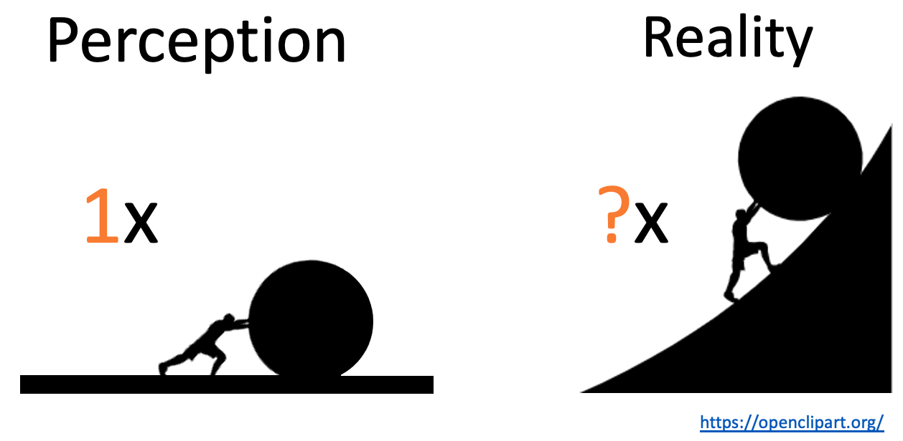

---

## Workflows have interconnected steps.


---

## If you change code or data...


---

## ...the downstream steps are no longer valid.


---

## Dilemma: short runtimes or reproducible results?

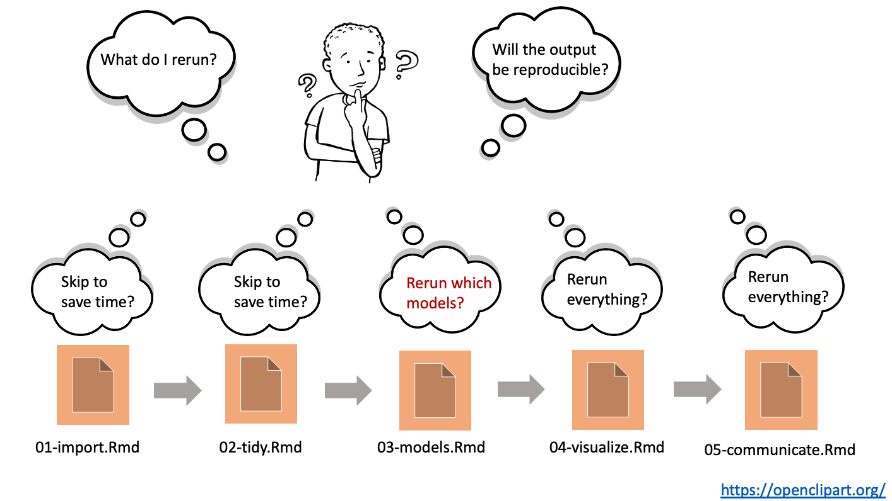

---

## Let a pipeline tool figure out what to rerun.


* Save time while ensuring computational reproducibility.
* Automatic parallel/distributed computing based on the directed acyclic graph.

---

## Pipeline tools

<center>

</center>

* Existing pipeline tools: https://github.com/pditommaso/awesome-pipeline
* Most are language-agnostic or designed for Python or the shell.

## {targets}

* Fundamentally designed for R.
* Supports a clean, modular, function-oriented programming style.
* Abstracts files as R objects and automatically manages data.
* Surpasses the permanent limitations of its predecessor, [`drake`](https://github.com/ropensci/drake): <https://books.ropensci.org/targets/drake.html>.
* Continuation of the ideas from `remake` by Rich FitzJohn: <https://github.com/richfitz/remake>.

---

## Challenge

* Most pipelines have a lot of user-side code.
* `targets` prefers code to be in pure user-defined functions.
* Leads to a lot of user-side software engineering.

## Solutions for Bayesian workflows

* `stantargets` reduces the volume of user-side code and automates entire validation pipelines: <https://docs.ropensci.org/stantargets/articles/simulation.html>
* Target Markdown is a comfortable interface for interactive prototyping and non-interactive pipeline construction: <https://books.ropensci.org/targets/markdown.html>
  
---

## Extending {targets}


---

## Target factories

* A target factory is a reusable function that creates target objects.

```{r, eval = FALSE}
target_factory <- function(file) {
  list(
    tar_target_raw("file", file, format = "file", deployment = "main"),
    tar_target_raw("data", quote(read_data(file)), format = "fst_tbl", deployment = "main"),
    tar_target_raw("model", quote(run_model(data)), format = "qs")
  )
}
```

---

## Target factories simplify pipeline construction.

```{r, eval = FALSE}
# _targets.R
library(targets)
library(yourExamplePackage)
list(
  target_factory("data.csv")
)
```

```{r, eval = FALSE}
# R console
tar_manifest(fields = command)
#> # A tibble: 3 x 2
#>   name  command          
#>   <chr> <chr>            
#> 1 file  "\"data.csv\""   
#> 2 data  "read_data(file)"           
#> 3 model "run_model(data)"
```

---

## Example: {stantargets}

<center>
<image src="./images/stantargets.png" height = "300px">
</center>

* Easy pipeline construction for Stan statistical models.
* Uses R packages [`cmdstanr`](https://mc-stan.org/cmdstanr/) and [`posterior`](https://mc-stan.org/posterior/).

---

## About Stan

* Probabilistic programming language ([Carpenter et al. 2017](https://www.jstatsoft.org/article/view/v076i01)).
* Markov chain Monte Carlo (MCMC) with HMC and NUTS.
    * Often more efficient than Gibbs sampling.
    * Flexible specification of posterior distributions.
    * Indifferent to conjugacy.
* Variational inference (ADVI)
* Penalized MLE (L-BFGS)

---

## Example: Bayesian longitudinal model for clinical trials

<!--
$$
\begin{aligned}
& y \sim \text{MVN}(X_{(n \cdot t) \times p} \beta, \ I_{n \times n} \otimes \Sigma_{t \times t} ) \\
& \qquad \beta \sim \text{MVN} (0, 10^2 I_{p \times p})\\
&  \qquad \Sigma_{t \times t} = \left (I_{t \times t} \sigma \right ) \Lambda_{t \times t} \Lambda_{t \times t}' \left (I_{t \times t} \sigma \right ) \\
& \qquad \qquad \sigma_1, \ldots, \sigma_t \stackrel{\text{ind}}{\sim} \text{Cauchy}^+(0, 5) \\
& \qquad \qquad \Lambda_{t \times t}\Lambda_{t \times t}' \sim \text{LKJ}(\text{shape} = 1, \text{order} = t)
\end{aligned} 
$$
-->


* A common variant of this model uses inverse-Wishart for the covariance, which induces troublesome prior relationships among covariance components ([Alvarez et al. 2016](https://arxiv.org/abs/1408.4050)).
* The above LKJ-based model could help refine some existing models currently used on real clinical trial data. 
* **But first, we need to ensure the above model is implemented correctly.**

---

## Interval-based validation study

* For several independent replications:
    * Simulate data from the prior predictive distribution.
    * Fit the model to the simulated data using MCMC.
    * Calculate x% posterior intervals for each scalar parameter.
* For each of scalar parameter, roughly x% of the posterior intervals should cover the corresponding parameter draws from the joint prior.
* 50% and 95% are common choices for x%.
* Simulation-based calibration extends this idea further ([Cook et al. 2006](https://www.jstor.org/stable/27594203); [Talts et al. 2020](https://arxiv.org/abs/1804.06788)).

---

## Write the pipeline in Target Markdown

* R Markdown interface for `targets`.
* Interactive mode for prototyping and emulation.
* Non-interactive mode for pipeline construction.
* Template available through RStudio.

<center>

</center>

---

## One function to simulate prior predictive data

* No other user-defined function required.
* Interactive mode emulates `targets`' behavior in your local environment.

<center>
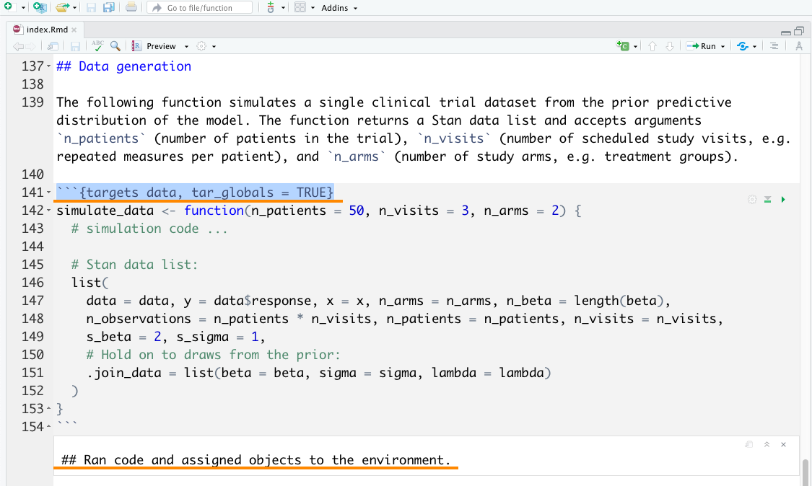
</center>

---

## Simulation and MCMC with {stantargets}

* Non-interactive mode writes the `_targets.R` file and supporting scripts.
* Declares targets but does not run them.

<center>
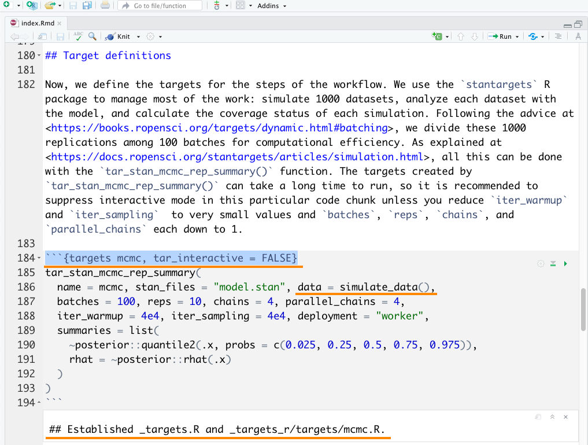
</center>

---

## Simple target for convergence diagnostics

<center>

</center>

---

## Simple target for coverage statistics

<center>
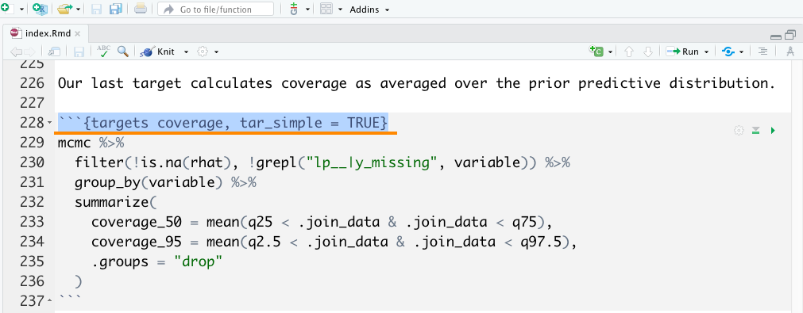
</center>

---

## Optional R code chunk to run the pipeline

* Either run the pipeline in an ordinary R code chunk (below) or invoke `tar_make_clustermq()` outside the R Markdown report.

<center>
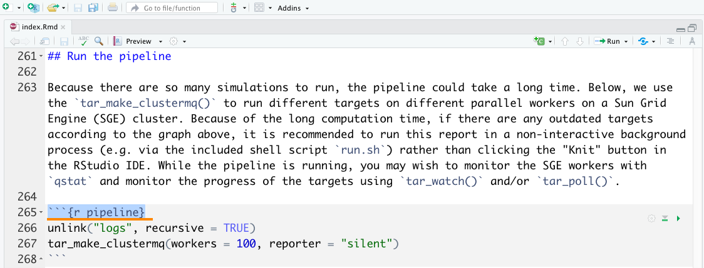
</center>

---


## Optional R code chunks to read the results

<center>
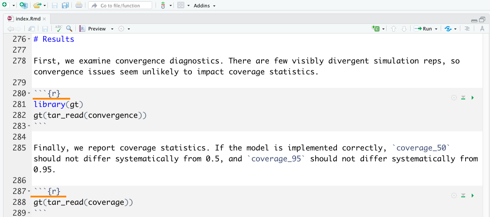
</center>

---


## First run takes a long time.

<center>
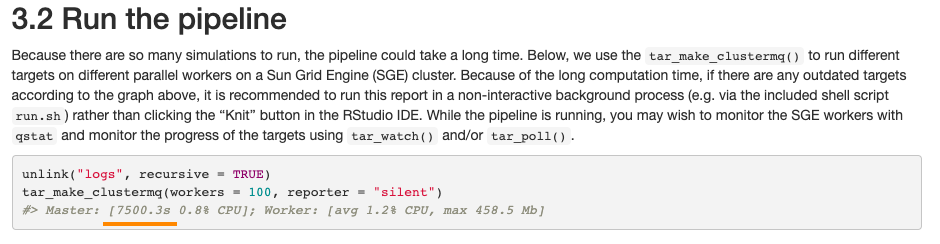
</center>

---

## Subsequent runs skip up-to-date targets.

<center>
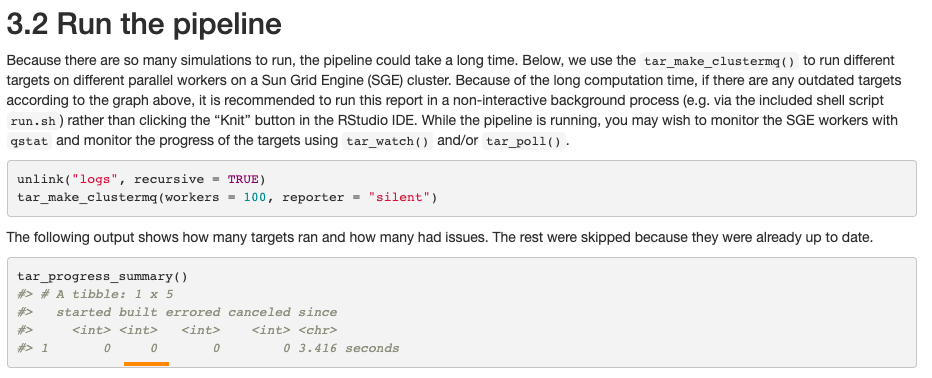
</center>

---

## Convergence diagnostics

<center>
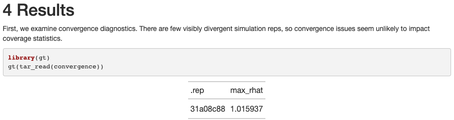
</center>

---

## Coverage is nominal.

<center>
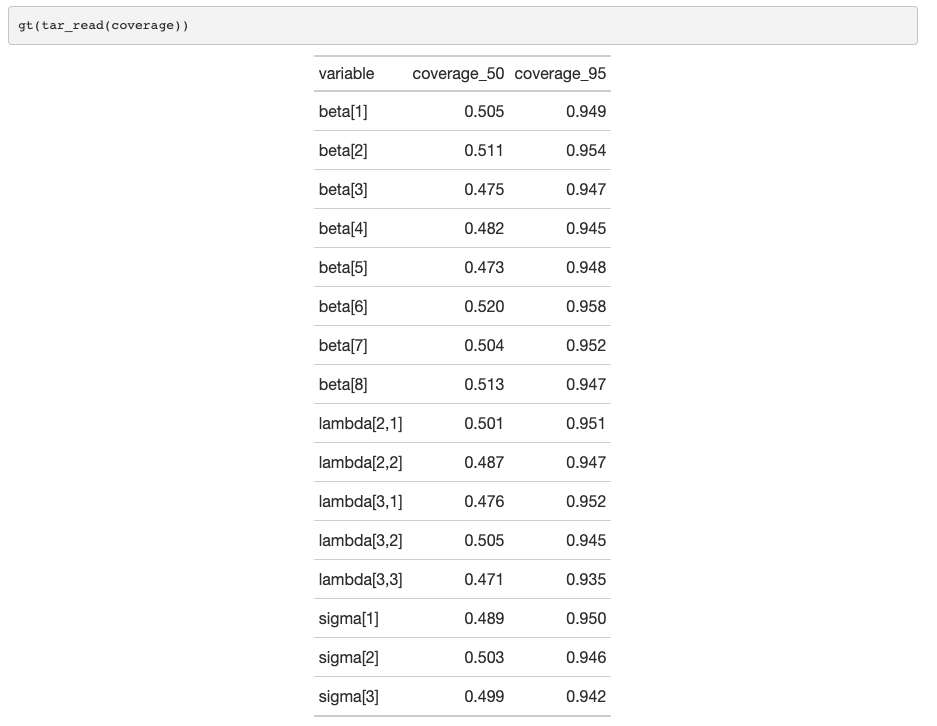
</center>

---

## Thanks

* `stantargets`: Melina Vidoni served as editor and Krzysztof Sakrejda and Matt Warkentin served as reviewers during the rOpenSci software review process.
* Target Markdown: Christophe Dervieux and Yihui Xie provided crucial advice during initial development.
* Richard Payne and Karen Price reviewed this Bayesian model validation project.

## Resources

* Source: <https://github.com/wlandau/rmedicine2021-pipeline>
* Slides: <https://wlandau.github.io/rmedicine2021-slides/>
* `targets`: <https://docs.ropensci.org/targets/>
* Target Markdown: <https://books.ropensci.org/targets/markdown.html>
* `stantargets`:  <https://docs.ropensci.org/stantargets/>
* Stan: <https://mc-stan.org/>
* `cmdstanr`: <https://mc-stan.org/cmdstanr/>
* `posterior`: <https://mc-stan.org/posterior/>

---

## References

.small[
* Alvarez, Ignacio, Jarad Niemi, and Matt Simpson. 2016. “Bayesian Inference for a Covariance Matrix.” http://arxiv.org/abs/1408.4050.
* Bürkner P, Gabry J, Kay M, Vehtari A (2021). “posterior: Tools
for Working with Posterior Distributions.” R package version
0.1.6, <https://mc-stan.org/posterior>.
* Carpenter, Bob, Andrew Gelman, Matthew D. Hoffman, Daniel Lee, Ben Goodrich, Michael Betancourt, Marcus Brubaker, Jiqiang Guo, Peter Li, and Allen Riddell. 2017. Stan: A probabilistic programming language. Journal of Statistical Software 76(1). [10.18637/jss.v076.i01](https://www.jstatsoft.org/article/view/v076i01).
* Cook, Samantha R., Andrew Gelman, and Donald B. Rubin. 2006. “Validation of Software for Bayesian Models Using Posterior Quantiles.” Journal of Computational and Graphical Statistics 15 (3): 675–92. http://www.jstor.org/stable/27594203.
* Gabry, Jonah, and Rok Češnovar (2021). cmdstanr: R Interface
  to 'CmdStan'. https://mc-stan.org/cmdstanr,
  https://discourse.mc-stan.org.
* Gelman, Andrew. 2006. “Prior distributions for variance parameters in hierarchical models (comment on article by Browne and Draper).” Bayesian Analysis 1 (3): 515–34. https://doi.org/10.1214/06-BA117A.
* Gelman, Andrew, John B. Carlin, Hal S. Stern, David B. Dunson, Aki Vehtari, and Donald B. Rubin. 2014. Bayesian Data Analysis. Edited by Francesca Dominici, Julian J. Faraway, Martin Tanner, and Jim idek. Third. CRC Press.
* Landau, William Michael. 2021a. “The Stantargets R Package: A Workflow Framework for Efficient Reproducible Stan-Powered Bayesian Data Analysis Pipelines.” Journal of Open Source Software 6 (60): 3193. https://doi.org/10.21105/joss.03193.
* ———. 2021b. “The Targets R Package: A Dynamic Make-Like Function-Oriented Pipeline Toolkit for Reproducibility and High-Performance Computing.” Journal of Open Source Software 6 (57): 2959. https://doi.org/10.21105/joss.02959.
* Schubert, Michael. 2019. “clustermq enables efficient parallelization of genomic analyses.” Bioinformatics 35 (21): 4493–95. https://doi.org/10.1093/bioinformatics/btz284.
* Talts, Sean, Michael Betancourt, Daniel Simpson, Aki Vehtari, and Andrew Gelman. 2020. “Validating Bayesian Inference Algorithms with Simulation-Based Calibration.” http://arxiv.org/abs/1804.06788.
* Xie, Yihui, J.J. Allaire, and Garrett Grolemund (2018). R Markdown: The Definitive Guide. Chapman and Hall/CRC. ISBN 9781138359338. https://bookdown.org/yihui/rmarkdown.
* Xie, Yihui, Christophe Dervieux, and Emily Riederer (2020). R Markdown Cookbook. Chapman and Hall/CRC. ISBN 9780367563837. https://bookdown.org/yihui/rmarkdown-cookbook.
]
